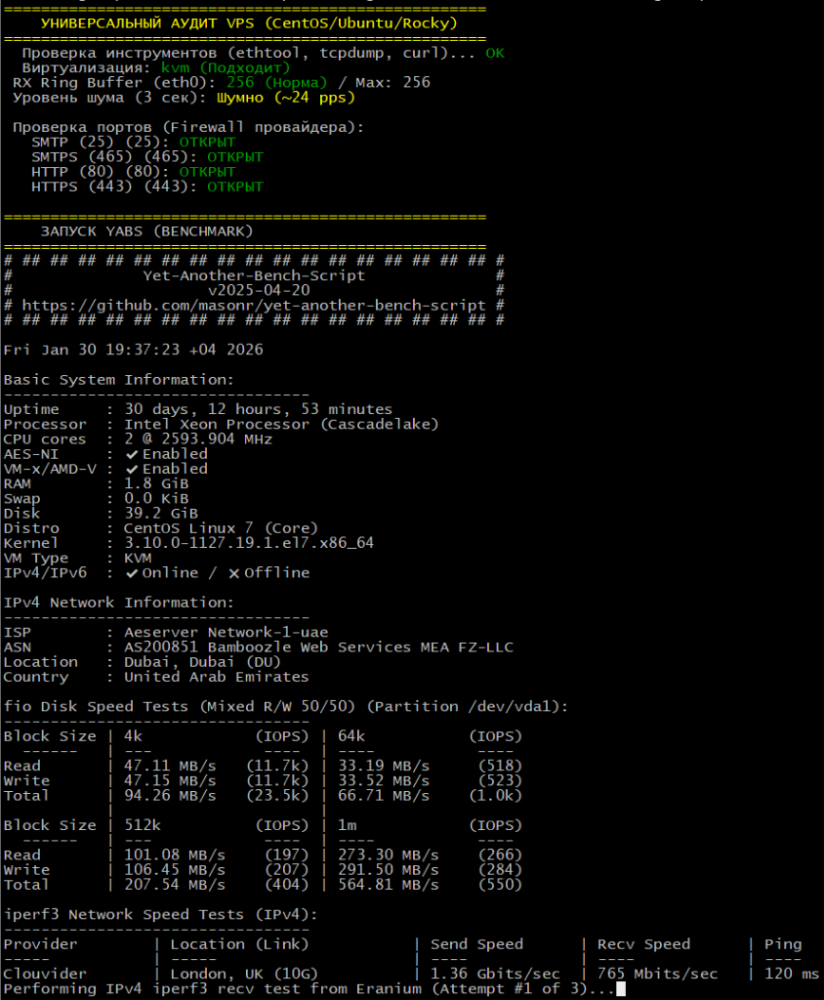

# 🔍 VPS Audit

[](https://opensource.org/licenses/MIT)
[](https://www.gnu.org/software/bash/)
[](https://raw.githubusercontent.com/aleksandrgrn/vps-audit/master/audit.sh)

Универсальный Bash-скрипт для быстрой диагностики VPS-серверов. Совместим с **Ubuntu/Debian** и **RHEL/CentOS/Rocky**.



## 🚀 Быстрый старт

```bash
curl -sL https://is.gd/LLoGt2 | bash
```

<details>
<summary>Альтернативная ссылка (полная)</summary>

```bash
curl -sL https://raw.githubusercontent.com/aleksandrgrn/vps-audit/master/audit.sh | bash
```
</details>

## 📋 Что проверяет

| Проверка | Описание |
|----------|----------|
| 🖥 Виртуализация | KVM/VMware/Xen — подходит ли для Docker/WireGuard |
| 🌊 RX Ring Buffer | Размер сетевого буфера (риск потери пакетов) |
| 🔊 Broadcast Storm | Уровень шума в сети (3 сек замер) |
| 📬 Порты | SMTP (25/465), HTTP (80), HTTPS (443) |
| 🚀 YABS Benchmark | Полный тест CPU/Disk/Network |

## ⚙️ Зависимости

Скрипт автоматически установит недостающие пакеты:
- `ethtool`
- `tcpdump`  
- `curl`

## 📄 Лицензия

[MIT](LICENSE)
